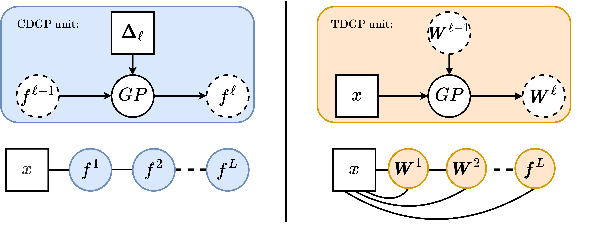

# Thin and Deep Gaussian Processes
This repository is the official implementation of the methods in the publication
* Daniel Augusto de Souza, Alexander Nikitin, S. T. John, Magnus Ross, Mauricio A. Álvarez, Marc Peter Deisenroth, João P. P. Gomes, Diego Mesquita, and César Lincoln Mattos. (2023). **Thin and Deep Gaussian Processes**. In *Advances in Neural Information Processing Systems (NeurIPS) 2023*. [[arXiv]](https://arxiv.org/pdf/2310.11527.pdf)

<p align="center">
  
</p>

# Install

This library was implemented against Python 3.10.8. To install it and its dependencies, please do:

```
pip install -r requirements.txt
pip install --no-deps uq360==0.2
python setup.py develop
```

# Run:
To reproduce the plots and results of our synthetic experiment, please run:
```
python 'synthetic experiment.py'
```
This script will generate the plots used in paper alongside additional plots. This script is also formatted as a percent format notebook that can also be open as a [jupytext](https://jupytext.readthedocs.io/en/latest/index.html) notebook or in many IDEs (Spyder, VS Code, PyCharm, etc).

## Citation
If you use the code in this repository for your research, please cite the paper as follows:
```bibtex
@article{desouza2023deep,
      title={Thin and Deep Gaussian Processes}, 
      author={Daniel Augusto de Souza and Alexander Nikitin and ST John and Magnus Ross and Mauricio A. Álvarez and Marc Peter Deisenroth and João P. P. Gomes and Diego Mesquita and César Lincoln C. Mattos},
      year={2023},
      eprint={2310.11527},
      archivePrefix={arXiv},
      primaryClass={stat.ML}
}
```
